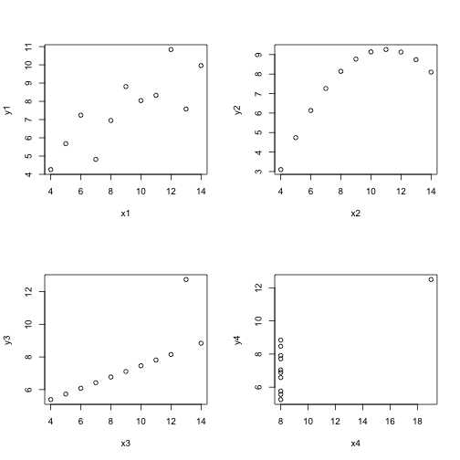
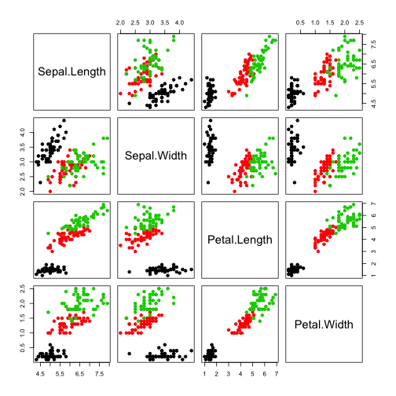
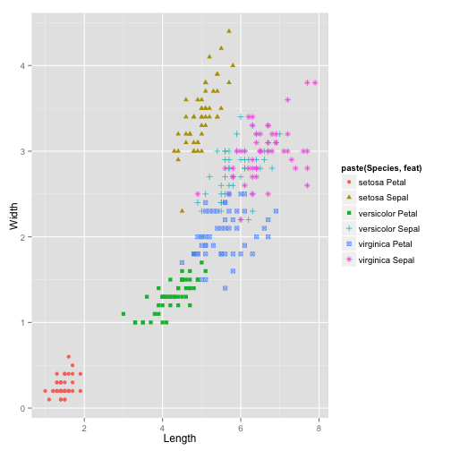
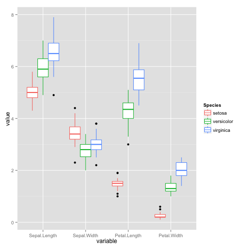
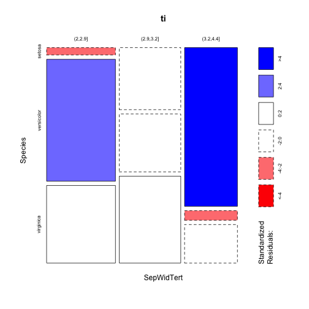
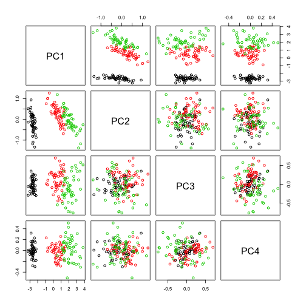
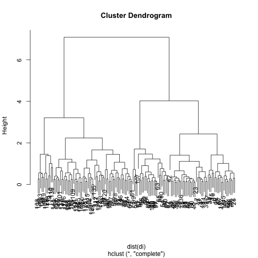

<h2>Preliminaries with R and statistical analysis</h2>


<h3>Statistical analysis of some small datasets</h3>

<h4>Ambiguities of simple statistical summaries</h4>

The <code>anscombe</code> data are specially constructed to
illustrate limitations of standard statistical summaries.


```r
data(anscombe)
anscombe[1:3, ]
```

```
##   x1 x2 x3 x4   y1   y2    y3   y4
## 1 10 10 10  8 8.04 9.14  7.46 6.58
## 2  8  8  8  8 6.95 8.14  6.77 5.76
## 3 13 13 13  8 7.58 8.74 12.74 7.71
```

```r
par(mfrow = c(2, 2))
for (i in 1:4) plot(anscombe[, i], anscombe[, i + 4], xlab = paste("x", i, sep = ""), 
    ylab = paste("y", i, sep = ""))
```

 


Show that the correlation and (simple linear) regression coefficients relating
$y_i$ to $x_i$, $i = 1, \ldots, 4$ are identical to 3 decimal places.
Use quadratic regression to model the second configuration and
comment on the distribution of residuals.

<h4>Multivariate analysis of plant anatomy</h4>

<h4>Three visualizations of iris flower measurements</h4>

Fisher's iris data are readily available.  The scatterplot
matrix is easily formed and suggests that the measurements
can be used to discriminate species.

```r
head(iris)
```

```
##   Sepal.Length Sepal.Width Petal.Length Petal.Width Species
## 1          5.1         3.5          1.4         0.2  setosa
## 2          4.9         3.0          1.4         0.2  setosa
## 3          4.7         3.2          1.3         0.2  setosa
## 4          4.6         3.1          1.5         0.2  setosa
## 5          5.0         3.6          1.4         0.2  setosa
## 6          5.4         3.9          1.7         0.4  setosa
```

```r
pairs(iris[, -5], col = factor(iris[, 5]), pch = 19)
```

 


It is not straightforward to annotate this plot.  With some
reshaping of the data, <emph>ggplot2</emph> may be more
communicative.


```r
irsep = cbind(iris[, c(1, 2, 5)], feat = "Sepal")
irpet = cbind(iris[, c(3, 4, 5)], feat = "Petal")
names(irsep)[1:2] = c("Length", "Width")
names(irpet)[1:2] = c("Length", "Width")
ir = rbind(irsep, irpet)
head(ir)
```

```
##   Length Width Species  feat
## 1    5.1   3.5  setosa Sepal
## 2    4.9   3.0  setosa Sepal
## 3    4.7   3.2  setosa Sepal
## 4    4.6   3.1  setosa Sepal
## 5    5.0   3.6  setosa Sepal
## 6    5.4   3.9  setosa Sepal
```

```r
library(ggplot2)
ggplot(ir) + geom_point(aes(x = Length, y = Width, 
    colour = paste(Species, feat), shape = paste(Species, 
        feat)))
```

 


For a final view of the data, we will reshape the
data frame and use <emph>ggplot2</emph> again.


```r
library(reshape2)
miris = melt(iris)
```

```
## Using Species as id variables
```

```r
ggplot(miris) + geom_boxplot(aes(x = variable, 
    y = value, colour = Species))
```

 


<h4>Categorical data analysis</h4>

It is sometimes useful from an interpretive perspective
to consider discretizations of measured quantities.
For example, in the iris data, we may define thresholds
for long, short and intermediate petal lengths.  There
is an ad hoc aspect to choosing the thresholds, and in some
cases interpretation may be sensitive in
a substantively important way to details of the choice.

Relationships among categorical variables
can be described using statistical
analysis of contingency tables.  Observations are
cross-classified according to categories occupied
by different attributes.  The discipline of loglinear
modeling establishes likelihood-based procedures
for comparing different formal models for
relationships among variables.  A 
hypothesis that can be tested in loglinear modeling of
variables X, Y, Z is ``X is conditionally independent
of Y given Z''.  Networks of relationships can often
be usefully characterized by elaborating statements of
this type, and the discipline of graphical modeling
pursues this idea.

To illustrate this on a very small scale, we will form tertiles for the
iris sepal width measurements and test for independence
of this discretized score with iris species.
The mosaic plot can give an indication of goodness of fit
for a specific loglinear model for a contingency table.

Exercise:
Check the documentation of the
functions used here, focusing on the interpretation of the margin
parameter, and develop more comprehensive models for
discretized versions of the iris measurements.


```r
tertiles = function(x) cut(x, quantile(x, c(0, 
    1/3, 2/3, 1)))
ti <- with(iris, table(SepWidTert = tertiles(Sepal.Width), 
    Species))
ti
```

```
##            Species
## SepWidTert  setosa versicolor virginica
##   (2,2.9]        2         33        21
##   (2.9,3.2]     15         14        21
##   (3.2,4.4]     33          2         8
```

```r
mosaicplot(ti, margin = list(1, 2), shade = TRUE)
```

 

```r
chisq.test(ti)
```

```
## 
## 	Pearson's Chi-squared test
## 
## data:  ti
## X-squared = 65.62, df = 4, p-value =
## 1.909e-13
```

```r
chisq.test(ti[, -1])
```

```
## Warning: Chi-squared approximation may be
## incorrect
```

```
## 
## 	Pearson's Chi-squared test
## 
## data:  ti[, -1]
## X-squared = 7.657, df = 2, p-value =
## 0.02174
```


<h4>Principal components</h4>

The simplest approach works from a matrix representation of the numerical
data.

```r
di = data.matrix(iris[, 1:4])
pdi = prcomp(di)
pairs(pdi$x, col = factor(iris$Species))
```

 


Interpret:

```r
pairs(pdi$x, col = factor(iris$Species))
```

 

```r
cor(pdi$x[, 1], iris[, 1:4])
```

```
##      Sepal.Length Sepal.Width Petal.Length
## [1,]       0.8974     -0.3987       0.9979
##      Petal.Width
## [1,]      0.9665
```

```r
cor(pdi$x[, 2], iris[, 1:4])
```

```
##      Sepal.Length Sepal.Width Petal.Length
## [1,]      -0.3906     -0.8252      0.04838
##      Petal.Width
## [1,]     0.04878
```


<h4>Machine learning: unsupervised</h4>

We'll use hierarchical clustering to look for
structure in the iris measurements.

```r
c1 = hclust(dist(di))
plot(c1)
```

 


Choice of features and distance for comparing
and clustering objects are key determinants of
results of cluster analyses.  The exercises
involve assessment of distances used in this simple
hierarchical clustering.  Consider how to assess the
sensitivity of the cluster assignments to
choice of feature set and distance function.

Exercise:  Evaluate <code>names(c1)</code>.  Explain
the value of <code>c1\$merge[1,]</code> (consult the
help page for <code>hclust</code>).

Explain:
<code>
> which(c1$height>.25)[1]
[1] 44
> c1$merge[44,]
[1] -69 -88
> dist(iris[c(69,88),-5])
          69
88 0.2645751
</code>


<h4>Machine learning: supervised</h4>

We'll take a training sample from the iris data,
use ``random forests'' to generate a prediction
procedure, and check concordance of predictions
and given labels for a test set.


```r
set.seed(1234)
s1 = sample(1:nrow(iris), size = nrow(iris) * 
    0.75, replace = FALSE)
train = iris[s1, ]
test = iris[-s1, ]
library(randomForest)
rf1 = randomForest(Species ~ ., data = train)
rf1
```

```
## 
## Call:
##  randomForest(formula = Species ~ ., data = train) 
##                Type of random forest: classification
##                      Number of trees: 500
## No. of variables tried at each split: 2
## 
##         OOB estimate of  error rate: 3.57%
## Confusion matrix:
##            setosa versicolor virginica
## setosa         40          0         0
## versicolor      0         32         2
## virginica       0          2        36
##            class.error
## setosa         0.00000
## versicolor     0.05882
## virginica      0.05263
```


Here we will use a generic `predict' method with
<code>newdata</code> argument.

```r
table(predict(rf1, newdata = test), test$Species)
```

```
##             
##              setosa versicolor virginica
##   setosa         10          0         0
##   versicolor      0         15         1
##   virginica       0          1        11
```


<emph>Exercise:</emph> The misclassified test cases must be 'hard'.
Write the R code to find them and examine the raw values in relation
to the correctly classified cases (perhaps summarized statistically).


<h3>Data input</h3>

Various bioinformatic workflows generate data in various
formats.  A key hurdle for analysts is conversion from the
workflow export into analyzable structures.  Bioconductor
addresses lots of such problems.  

For data of modest volume "CSV" is a common hub format -- scientists
often use MS Excel to examine and manage data, and it is easy
to export Excel spreadsheets into textual comma-separated values.
R's <code>read.csv</code> will handle any genuine CSV file.

The ``data import and export'' manual at the R project web site
should be carefully studied.  We will deal with specific problems
throughout the course.

For genomic data, particularly annotations (browser tracks)
the <emph>rtracklayer</emph> package performs many useful tasks
of import and export.


```

